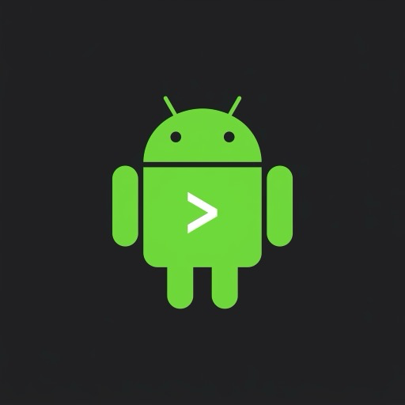

<p align="center">
  
</p>

<h1 align="center">Android Toolkit for Raycast</h1>

<p align="center">
  A powerful Raycast extension to manage Android devices via ADB — right from your keyboard.
</p>

<p align="center">
  
  
  
</p>

---

## ✨ Features

| Command                   | Description                                                                                   |
| ------------------------- | --------------------------------------------------------------------------------------------- |
| 🗂 **Manage Users & Apps** | List all device profiles (Personal, Work), browse & search installed apps with readable names |
| 📦 **Install APK**        | Pick an `.apk` file from Finder and install it to any user profile                            |
| 📸 **Take Screenshot**    | Capture the device screen and copy it directly to clipboard                                   |
| 📱 **Manage Devices**     | List connected ADB devices, connect via Wi-Fi, restart ADB server                             |

### App Management Actions

For each app in **Manage Users & Apps**, you can:

- **Open Logs in Terminal** — streams live logcat filtered by package name
- **Clear App Data** — wipe storage and cache (`Cmd+Shift+Backspace`)
- **Uninstall App** — removes app from the selected profile (`Ctrl+X`)

---

## 🚀 Installation

### Install from Source

**Prerequisites:**

- [Raycast](https://raycast.com/) installed
- [Node.js](https://nodejs.org/) (v18+) and npm
- Android Debug Bridge (`adb`) installed — via [Android SDK Platform Tools](https://developer.android.com/tools/releases/platform-tools)

**Steps:**

```bash
# Clone the repository
git clone https://github.com/YOUR_USERNAME/android-toolkit-raycast.git
cd android-toolkit-raycast

# Install dependencies
npm install

# Start development server (loads the extension into Raycast)
npm run dev
```

Raycast will automatically detect and load the extension. Search for any of the commands above!

---

## ⚙️ Configuration

Open Raycast Preferences (`Cmd + ,`) → **Extensions** → **Android Toolkit** to configure:

| Setting                  | Default | Description                                                             |
| ------------------------ | ------- | ----------------------------------------------------------------------- |
| **ADB Executable Path**  | `adb`   | Full path to `adb` binary if not in `$PATH` (e.g. `/usr/local/bin/adb`) |
| **Show System Profiles** | Off     | Show hidden profiles like Dual App (95), Secure Folder (150)            |

### Finding your ADB path

```bash
which adb
# Example output: /usr/local/bin/adb
# or: /Users/you/Library/Android/sdk/platform-tools/adb
```

---

## 🔌 ADB Setup

**Connect via USB:**

```bash
# Enable Developer Options on your device, then enable USB Debugging
adb devices  # Should list your device
```

**Connect via Wi-Fi (from Manage Devices command):**

1. Connect device via USB first
2. Open **Manage Devices** → select device → **Connect via Wi-Fi**
3. Disconnect USB — device remains connected wirelessly

---

## 🛠 Development

```bash
npm run dev      # Start dev server (hot reload)
npm run build    # Build for production
npm run lint     # Lint source files
npm run fix-lint # Auto-fix lint issues
```

### Project Structure

```
android-toolkit-raycast/
├── assets/
│   └── command-icon.png       # Extension icon (512×512 PNG)
├── src/
│   ├── utils/
│   │   ├── adb.ts             # ADB command wrapper & helpers
│   │   └── terminal.ts        # Terminal integration (AppleScript)
│   ├── manage-users.tsx       # Manage Users & Apps command
│   ├── install-apk.tsx        # Install APK command
│   ├── take-screenshot.tsx    # Take Screenshot command
│   └── manage-devices.tsx     # Manage Devices command
├── package.json               # Extension manifest & dependencies
└── tsconfig.json
```

## 📦 Publish to Raycast

Publish the extension to the Raycast Store:

```bash
npm run publish
```

The Raycast CLI will validate the extension and guide you through the store submission flow.

---

## 📄 License

MIT © [Swapnil](https://github.com/YOUR_USERNAME)
